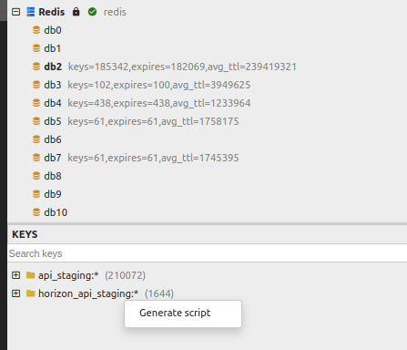

php artisan serve para rodar o projeto

# Criar registros
rota / cria os registros que tu precisa, até budget line items
# Enviar registros
- Eu criei 1 workspace, acessei ele como service account, e peguei o Cookie em qualquer request.
- Acessar `/admin-area/import-list` e criar 1 data importer, e copiar o data importer id
- Editar o arquivo `/storage/app/run.sh` e colocar esse cookie lá.
- Depois de rodar o criar registros, é só rodar esse script, e colocar o data importer como parâmetro

# Redis
rota `/redis` pega todos os dados que estão no redis, na DB0, e parsei pra gente
Para rodar, eu fui no dbgate, escolhi redis, clique com o botão direto do mouse e mandei `generate script`

Salvei o documento no gedit com o nome de redis011 e Ai fui no console, e mandar importar, com `redis-cli -h localhost -p 63790 < redis011`
